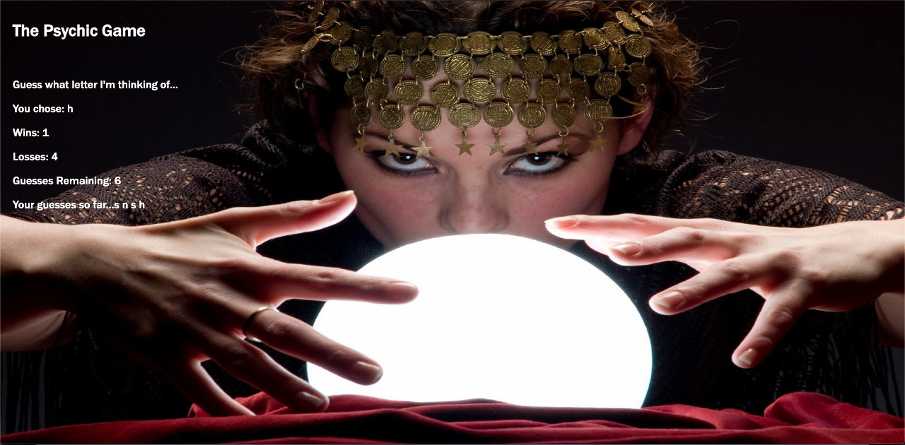

# Psychic-Game

___

The Psychic-Game assignment required the use of JavaScript in order to establish the game logic whereby a letter is chosen randomly by the computer. If the user guesses correctly by entering keystrokes within 10 tries, a win is added to their win total and an alert displays on the browser congratulating them for outsmarting the computer. If not, a loss is added to the loss total, a new letter is randomly selected by the computer, and the guesses remaining restart from 10.  

Initially I created the text formatting on the HTML file using unique id's that would fill in test using javascript. Next I linked the JavaScript file to the HTML file using a script tag. Variables were created with the choice of all 26 letters of the alphabet contained within a single string. Next, variables containing wins, losses, and guessesLeft were created with their starting values. An empty array with assigned to the variable guessedLetters in order to store the users keyup events within each turn of 10 guesses. The variable computerChoice was assigned to math.random to select a number within the length of the array and Math.floor in order to round the number.

I created a reset function in order to prevent the same keyup event that triggered a win to continue registering wins as long as it was pressed. The user's keyup with converted to lower case in order to accurately access the string variable containing the alphabet and stored in the userGuess variable. Then the userGuess variable was pushed into the empty array of guessed letters. For optimal display formatting, the guessedLetters array were assigned to another variable with the join method to prevent separating commas from displaying. The first conditional statement checks if the userGuess is greater than or equal to zero or if the length of userGuess is greater than one to determine if it is in fact a letter. If this condition is not passed, an alert will be issued on the brower informing the player to select a letter. If the condition passes, if the userGuess equates true for computerChoice, an alert issues on the browser informing the player they guessed correctly, a value of one is added to the win variable, guessesLeft resets to 10, guessedLetters empties the array, and finally the restFunc function is run to select a new letter. For each incorrect guess, the guessesLeft variable decrements by one. If guessesLeft reaches 0, the losses variable increases by one, the guessesLeft variable reassigns to 10, and the guessedLetters array is assigned to empty and displays as such on the brower. The text content is then coded to display to their assigned div's on the browser.  

In CSS the html and background-size identifiers were set to 100% to handle resizing of the viewport. The .container class was floated right with 10px of padding for formatting. Media-queries were completed for varying size viewport widths to adjust text as to not overlap with the crystal ball in the background image. I had originally intended for the text to display within the crystal ball in font-color black. Adjusting the container positioning at various viewport pixel sizes proved to be too ambitious and I look forward to revisiting this project and actualizing my vision for what could have been.

## Built With

___

* HTML
* CSS
* JavaScript

___

